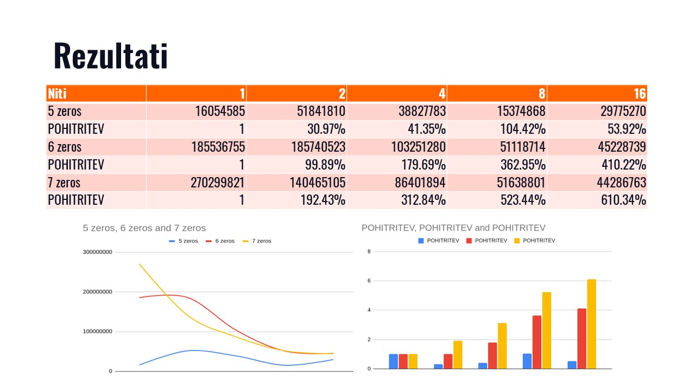
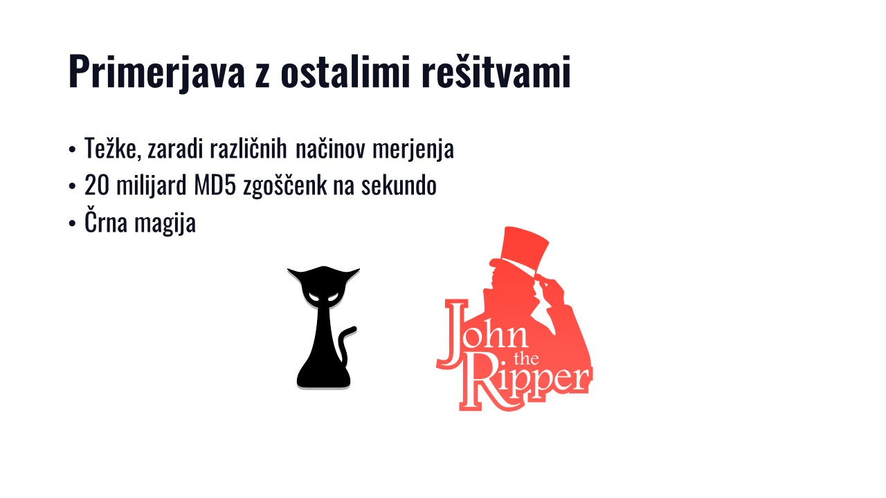

# Veriženje blokov

Seminarska naloga pri predmetu Porazdeljeni Sistemi.

Avtorja

- Lan Vukušič (OpenMPI / C++)
- Jan Vasiljevič (pThreads / C, OpenCL / Rust)

Predavatelj: Uroš Lotrič  
Asistent: Davor Sluga

## Viri in uporabne vsebine

SSL razvojna knjižnica

```s
sudo apt-get install -y libssl-dev
```

- [Navodila](docs/pdf/Projektne_naloge_PS2021.pdf)
- [Primer poročila](docs/pdf/primerPorocila.pdf)

## Opazki

- Zmeraj podaj `-lcrypto` na konec `gcc` komande.

## Datasets

Some datasets generated with [rust](util/md5-gen/src/main.rs). Maximumum `nonce` length was set to 5.
Quick instruction to use the rust program `cargo run [number_of_zeroes] [how_many_numbers_to_generate] [max_nonce_len]`. Or `cargo build --release` and then run the binary `./target/release/md5-gen` with same arguments. Building for release is recommended when generating hashes >6 zeroes as it may take several minutes.

Please remember that these datasets **may have other solutions**.

### 1 zero

```sh
------- WORDS AND NONCES -------
4a58557465 42616c
46473246 52
48523834 67356e
517a 544b79
6655446b 4a616a
------------ HASHES ------------
24d5b76135d1334900ee6ef6556038a0
c340d133f220cc69fafbdf93fc0164c0
0d873fc44da5c56c24823f17ab3a1b40
85b0d3c8a0dadb489574917a4c007d40
a75bdc4017dfdf402587e7eb773fdab0
```

### 2 zeroes

```sh
------- WORDS AND NONCES -------
6462487232 4a5770
3931765433 4258
7363 783445
583669 44795a35
6b523256 4f3471
------------ HASHES ------------
27158c21b48661dd7aa8edd45ae66200
aea931c509b688820d59f005aae8be00
bbade09e96109db5c08f9aaad3e34500
c5420808bd09929de6bc794a8fa26500
b68f83c340f448c41035f78eaafab400
```

### 3 zeroes

```sh
------- WORDS AND NONCES -------
617645414455 6d4a
6e45 58315238
4a59657237 45
385a59346c426c 65
367553 32574f
------------ HASHES ------------
f7a7ebd090eb316d623979dec3d63000
961af3ff0a02291f480040385de5e000
092f58bda9900231f6c842a91da8a000
45eb4dcd59e92af5c83141a49c0a4000
f3091b39bb533dd6c35752a9af4d2000
```

### 4 zeroes

```sh
------- WORDS AND NONCES -------
714f4c6c68 58
58434d70 4d
614476 754b52
67694545 4f77
75624e424a 4b
------------ HASHES ------------
6f439e403326ae36bd8f291a94440000
dc56405a7ae78f412cbc37a726c10000
898669a225bc74588ec37203ecbb0000
4ffdfe2d0458f78e31547c5cd6a40000
6e78d989bec39df4ea2027221e220000
```

### 5 zeroes

```sh
------- WORDS AND NONCES -------
78374852 354e6932
44584c69 693446
4564 6f397062
4c696835 5034
356f6b 6b37566b
------------ HASHES ------------
363de335f1a44a4acd3127ee9d400000
d56cc443a5170ca3d6d4213a61300000
d04f3c3fe7c919503e054107a7c00000
3a74b08f64a6173c277b3bf2a8a00000
d8eb4ab1d1bdc0d174ba9d5472700000
```

### 6 zeroes

```sh
------- WORDS AND NONCES -------
5a71 7a564c4e
5653773557 4645
307a773177 48764d
396a675343 7465
693948 5152446a
------------ HASHES ------------
edef1b69aa99c4ff4153e373dd000000
72a2b193ca519e187a0a0775df000000
b58c55f67f7f6d79f92f5bc058000000
766e8b94e7276e55d8b6a46f32000000
ca2ddc4a9fcb07a1514ebb5035000000
```

### 7 zeroes

```sh
------- WORDS AND NONCES -------
4c33343232 6d3639
61 4a785751
79453142 47773950
32613250 7055
614a 785751
------------ HASHES ------------
9e70154d69c21aebe596de5070000000
c955038a98abd90318a90affa0000000
cf1750d4f8e73eb69cdcb79a10000000
dd7a5a6910a6fde69ad9228390000000
c955038a98abd90318a90affa0000000
```

## Slides






