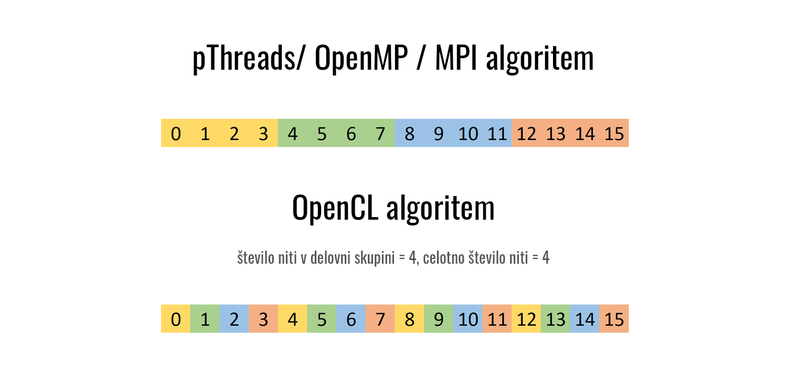
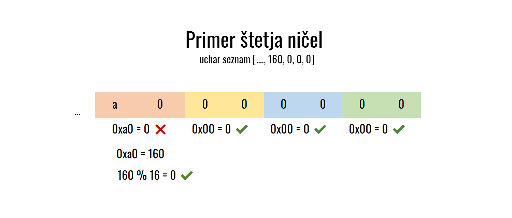

# OpenCL

## Grob opis delovanja

1. Program prebere parametre in preveri njihovo pravilnost. Program sprejme naslednje argumente

- `-f` datoteko iz katere beremo besede
- `-z` število ničel ki jih iščemo na koncu zgoščene vrednosti
- `-l` velikost delovne skupine (privzeto: 256)
- `-g` večkratnik s katerim je izračunano število vseh niti (privzeto: 12)
- `-s` zastavica, ki sporoči programu ali naj prevede šcepec, ki bo zraven štel koliko zgoščenih vrednosti (privzeto: izklopjena)   

2. Ustaviramo kontekst, izberemo napravo in na podlagi `-s` zastavice primerno prevedemo `kernel.cl`

3. Za vsako besedo podano v datoteki iteriramo od 1 do dolžine podane preko ukaza (maksimalno 8) oz. prekinemo ko najdemo rešitev. Na grafični procesni enoti rezerviramo prostor za

- velikost problemskega prostora (`256 ^ trenutna dolžina skovanke`)
- število ničel ki jih iščemo - iterativna spremenljivka v zanki
- dolžino besede za katero iščemo skovanko
- besedo za katero iščemo skovanko
- dolžina skovanke ki jo iščemo
- zastavico za sihronizacijo niti
- prostor za rešitev (velikosti `u64` ker iščemo skovanke do dolžine 8)
- dolžina najdene skovanke

Po potrebi rezerviramo še prostor za skupno število izračunanih zgoščenih vrednosti in pomnilnik za shranjevanje deljenih vrednosti znotraj delovne skupine, če je bila podana `-s` zastavica ob zagonu programa. GPE je pripravljena za računanje.

4. Vsak šcepec računa posamezne zgoščene vrednosti dokler ni preiskan celoten problemski prostor (sinhronizacija na CPU-ju) ali pa ena izmed niti ne najde rešitve (sinhronizacija preko zastavice v globalnem spominu). Vsaka nit preverja ali ima izračunano vrednost pravilno število ničel, če nima, nadaljuje s delom. OpenCL algoritem za izračun MD5 zgoščene vrednosti je bil povzet virih [pdfcrack](https://github.com/awreece/ pdfcrack-opencl) in [oclHashcat](https://github.com/Rich5/oclHashcat/tree/master/OpenCL). Skovanke se prenašajo po pomnilniku kakor nepredznačene 64 bitne številke, zato da je delovanje hitrejše in potrebuje manj pomnilnika na grafični enoti. 

## Podrobnosti delovanja

Kakor smo spoznal v prejšnem razdelku, je algoritem za računanje na grafični procesnih enot precej drugačen od CPU pristopa. Nekaj manjših a pomembnih razlik je navedenih v nadaljevanju.

### Zajemanjev podatkov 
Eden izmed ciljev pri tej izvedbi je bilo poljubno število delavcev, zato ta rešitev ne deluje po principu delitve problemskega prostora, temveč vsak delavec sam poišče novo besedo, ki jo mora obdelati.

```c
__private ulong g_id, nonce_word;

g_id = get_global_id(0);

while (g_id < problem_space) {
    nonce_word = g_id;

    // ...

    g_id += get_global_size(0);
}
```


> Slika prikazuje različna načina zajemanja podatkov pri zelo poenostavljenem primeru. Posamezne barve predstavljajo nit. Vidimo, da bi OpenCL pristop deloval tudi če bi velikost problemskega prostora bila 15 (oranžna nit bi opravila 3 izračune zgoščene vrednosti namesto 4), medtem ko bi pristop z delitvijo prostora z bitnimi maskami propadel - deluje namreč le na številkah potence 2. Vidimo tudi, da ker niti obdelujejo primere v drugačnem vrstnem redu, ne nujno dobimo iste rezultate če je v problemskem prostoru več rešitev.

### Pretvorba podatkov 

Šcepec more vsako besedo pravilno pretvoriti v seznam črk, kar učinkovito dosežemo s bitno aritmetiko

```c
for (i = 0; i < word_length; i++) in[i] = word[i];
		
for (i = 0; i < nonce_len; i++, nonce_word = nonce_word >> 8) in[i + word_length] = (char)(nonce_word & 255);
```

Druga zanka je ekvivalenta 
```c
for (i = 0; i < nonce_len; i++, nonce_word /= 256) in[i + word_length] = (char)(nonce_word % 256);
```

### Štetje ničel

Ker želimo da šcepec vsebuje čim manj vejitev, je smiselno nekoliko prilagoditi način štetja ničel. Namesto da štejemo po en znak v heksadecimalnem zapisu, se nam splača šteti posamezne bajte in nato posebej obravnavati preostali heksadecimalni znak, kar lahko izvedemo z bitno aritmetiko.

```c
i = 15;

while (i >= 1 && out[i--] == 0) {}

if (28 - 2 * i + !(out[i + 1] & 15) == number_of_zeroes) //...
```


> Slika prikazuje primer štetja načina v OpenCL ščepcu. Barve prikazuje različne iteracije zanke; v rdeči iteraciji izpademo iz zanke. Izračun ostanka deljenja je v kodi izveden s `out[i + 1] & 15`

### Sinhronizacija niti 

Ko eden izmed delavcev najde rešitev, jo more zapisati na primerno lokacijo in sporočiti ostalim delavcem naj prenehajo s preiskovanjem. V globalnem pomnilniku hranimo zastavico, ki predstavlja zaustavitveni pogoj.

Branje zastavice
```c
while (g_id < problem_space && !atomic_max(work_flag, 0))
```

Zapis rešive in nastavlanje zastavice. Čeprav je rešitev sestavljena iz 16 bajtov, lahko z obravnavanjem spomina kot `uint` kazalec pohitrimo zanko - namesto 16 iteracij potrebujemo le 4
```c
if (!atomic_cmpxchg(work_flag, 0, 1)) {
    for (i = 0; i < 4; i++) solution[i] = ((uint *)out)[i];
    *nonce_solution = g_id;
} 
```

### Štetje izračunanih zgoščenih vrednosti

Za nekoliko bolj razumljive podatke in zanimivost samega programa, je možno šteti koliko izračunov zgoščene vrednosti vse niti skupaj izvedejo. Samo štetje in nato sinhronizacija niti, pa je proces ki vzame nekaj urinih ciklov. Za rešitev tega problema, je možna šcepec prevesti na 2 različna načina s pomočjo predprocesorskih direktiv in makrotov, ki jih pomožni program primerno nastavi . Uporabnik nato sam določi, ali želi videti dodatne informacije s pomočjo CLI argumentov.

### Priprava šcepca in pomožni program

Priprava OpenCL ščepca je spisana v programskem jeziku Rust, ki je sposoben istih performans kakor C, vendar ponuja tudi višjenivojske strukture in funkcijske pristope programiranja. Za delo s OpenCL je bila uporabljena knjižnica `cogciprocate/ocl`, ki se deli na 2 dela:   
- `ocl-core`, ki ima podobno sintakso C izvedbi in je 'nižjenivojska'  
- `ocl`, ki doda abstrakcije in višjenivojske funkcije    

Uporabljena je bila slednja z manjšo razširitvijo za lažjo berljivost.

```rust
let word_buffer = &que.new_buffer(&word, Some(MemFlags::new().read_only()));
let lock_buffer = &que.new_buffer(&lock, None);
let solution_buffer = &que.new_buffer(&solution, None);
let nonce_solution_buffer = &que.new_buffer(&nonce_solution, None);
let total_hashes_buffer = &que.new_buffer(&total_hashes, None);

let mut kernel_builder = que.kernel_builder("hash");

kernel_builder
    .local_work_size(args.local_work_size)
    .global_work_size(args.global_work_size_multiplier * args.local_work_size)
    .arg(problem_space)
    .arg(args.zeroes)
    .arg(word.len() as u32)
    .arg(word_buffer)
    .arg(nonce_len as u16)
    .arg(lock_buffer)
    .arg(solution_buffer)
    .arg(nonce_solution_buffer);

if args.show_hashrate {
    kernel_builder
        .arg(total_hashes_buffer)
        .arg_local::<u64>(args.local_work_size as usize);
}

let kernel = kernel_builder.build().expect("Building the kernel failed");

unsafe {
    kernel.enq().expect("Kernel enquing failed");
}

que.finish()?;
```
> Izsek kode Rust programa

## Testiranje 

Testiranje je bilo izvedeno na grafični procesni enoti NVIDIA RTX 2060 (2019 model), ki temelji Turing mikroarhitekturi in vsebuje 1920 CUDA jeder. Podpira do 1024 niti v delovni skupini, standard OpenCL C 1.2 in CL razširitev `cl_khr_int64_base_atomics`, ki je potrebna za delo s kazalci na `ulong` podatkovne tipe.

V nadaljevanju bomo videli da je OpenCL algoritem izjemno hitrejši od njegovega CPU predhodnika, zato je bil za testiranje uporabljen seznam 35 heksadecimalnih besed za katere iskali zgoščeno vrednost s 7-im končnimi ničlami.

```
Processing word 0x307a773177...
...increasing nonce length from 1 to 2...
...increasing nonce length from 2 to 3...
...increasing nonce length from 3 to 4...
> Solution 0e 26 3d 20 (nonce length 4) found in 489.53ms
> Calculated a total of 576,532,646 hashes (1,177,188,233 hashes/sec)
> Resulting hash: 0x9de93202 7de4167a 16162cc2 40000000

Processing word 0x396a675343...
...increasing nonce length from 1 to 2...
...increasing nonce length from 2 to 3...
...increasing nonce length from 3 to 4...
> Solution 43 28 e9 03 (nonce length 4) found in 82.83ms
> Calculated a total of 87,221,825 hashes (1,050,127,741 hashes/sec)
> Resulting hash: 0x917a099d d9c28458 586fd283 80000000
```
> Primer izpisa programa

### Iskanje optimalne velikosti delovne skupine

Testirano z ukazom `\target\release\rust-gpu.exe -f src/input.sh -z 7 -s -l x`, kjer je `x` velikost delovne skupine.

| Velikost delovne skupine | Čas izvajanja programa | Čas izvajanja ščepca | Izračuni zg. vrenodnosti / sec |
| ------------------------ | ---------------------- | -------------------- | ------------------------------ |
| 64                       | 20.61s                 | 20.47s               | 427.496.493                    |
| 128                      | 10.85s                 | 10.72s               | 809.146.829                    |
| 256                      | 7.33s                  | 7.20s                | 1.195.566.584                  |
| 512                      | 7.76s                  | 7.62s                | 1.153.213.884                  |
| 1024                     | 8.98s                  | 8.85s                | 978.161.310                    |

Program ne zažene toliko niti, kolikor je števil v problemskem prostoru, ker se je izkazalo da je to precej počasnejše - celoten program je deloval vsaj sekundo počasneje. Testirano z ukazom `.\target\release\rust-gpu.exe -f src/input.sh -z 7 -s -l 256 -g y`, kjer je `y` večkratnik delovne skupine.

| Globalni večkratnik | Število niti | Čas izvajanja programa | Čas izvajanja ščepca | Izračuni zg. vrenodnosti / sec |
| ------------------- | ------------ | ---------------------- | -------------------- | ------------------------------ |
| 8                   | 2048         | 10.05s                 | 9.92s                | 879.869.328                    |
| 12                  | 3072         | 7.18s                  | 7.18s                | 1.218.059.211                  |
| 16                  | 4096         | 7.21s                  | 7.08s                | 1.176.156.456                  |
| 20                  | 5120         | 7.10s                  | 6.97s                | 1.220.767.424                  |
| 24                  | 6144         | 7.19s                  | 7.07s                | 1.207.377.506                  |

Optimalni parametri za RTX 2060 so torej 
- velikost delovne skupine 256
- celotno število niti 5120

Isti seznam besed je bil testiran s pThreads izvedbo s 16 niti in `O3` levelom optimizacije, ki jo ponuja `gcc`. Čas trajanja CPU programa je bil 2138s. GPU algoritem torej doseže **301-kratno** pospešitev.